

    <h1><strong> 🚗🚌🚲 A Deep Learning Approach to Traffic Object Detection: YOLO11 and DETR on CCTV Datasets🚦</strong></h1>
    <h5>Thanks for visiting my notebook</h5>
    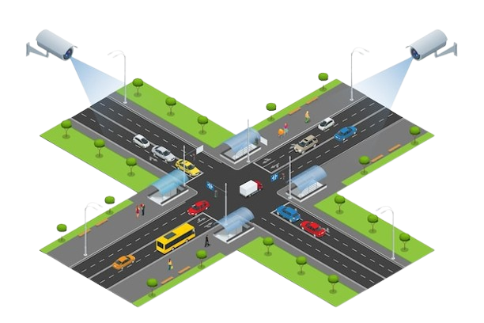

**Author**: Huy Nguyen  
**Last Updated**: 2025-06-01

#  🔍 Overview

Traffic object detection is a critical AI-driven task that involves identifying and classifying objects such as bicycles, buses, and cars in images or video streams, typically from CCTV cameras, dashcams, or drones. This technology plays a vital role in smart city infrastructure, autonomous vehicles, traffic management, and road safety analytics.  
With advancements in deep learning and computer vision, modern systems can detect and track mutilple object in real-time, even in complex urban environments. State-of-the-art models like <strong>YOLO (You Only Look Once)</strong> and <strong>DETR (Detection Transformer)</strong> enable high-speed, accurate detection by analyzing visual patterns in large datasets. 

This notebook provides a comprehensive benchmark of YOLO11 and DETR-Resnet50 architectures for CCTV-based traffic analysis, evaluating their suitability for smart city developments.

# 📝 Table of contents
1. <a href='#dataset'>Dataset Description</a>
2. <a href='#methodology'>Methodology</a>
4. <a href='#conclusion'>Conclusion</a>
3. <a href='#references'>References</a>

# Dataset Description
# 📂 Data Sources
| Dataset Name       | Source | Classes | Resolution | License |
|--------------------|--------|---------|------------|---------|
| [Street View](https://www.kaggle.com/datasets/yusufberksardoan/traffic-detection-project/data) | Kaggle | 5  [bicycle, bus, car, motorbike, person] | 640x640 | CC BY 4.0 |
| [Street View](https://universe.roboflow.com/fsmvu/street-view-gdogo/dataset/1) | Roboflow | 5  [bicycle, bus, car, motorbike, person] | 640x640 | CC BY 4.0 |

The dataset includes 6633 images.  

# 📊 Preview dataset
### Parsing the dataset into a dataframe
|    | category   |   x_center |   y_center |     width |    height | img_path                                                                             |
|---:|:-----------|-----------:|-----------:|----------:|----------:|:-------------------------------------------------------------------------------------|
|  0 | bicycle    |   0.498437 |   0.907813 | 0.0453125 | 0.18125   | datasets/train/images/aguanambi-1000_png_jpg.rf.0ab6f274892b9b370e6441886b2d7b9d.jpg |
|  1 | bicycle    |   0.5375   |   0.866406 | 0.0390625 | 0.16875   | datasets/train/images/aguanambi-1000_png_jpg.rf.0ab6f274892b9b370e6441886b2d7b9d.jpg |
|  2 | motorbike  |   0.636719 |   0.274219 | 0.021875  | 0.0765625 | datasets/train/images/aguanambi-1000_png_jpg.rf.0ab6f274892b9b370e6441886b2d7b9d.jpg |
|  3 | person     |   0.892969 |   0.442188 | 0.209375  | 0.245312  | datasets/train/images/aguanambi-1000_png_jpg.rf.0ab6f274892b9b370e6441886b2d7b9d.jpg |
|  4 | car        |   0.776563 |   0.272656 | 0.0640625 | 0.0859375 | datasets/train/images/aguanambi-1000_png_jpg.rf.0ab6f274892b9b370e6441886b2d7b9d.jpg |

### Show random images

  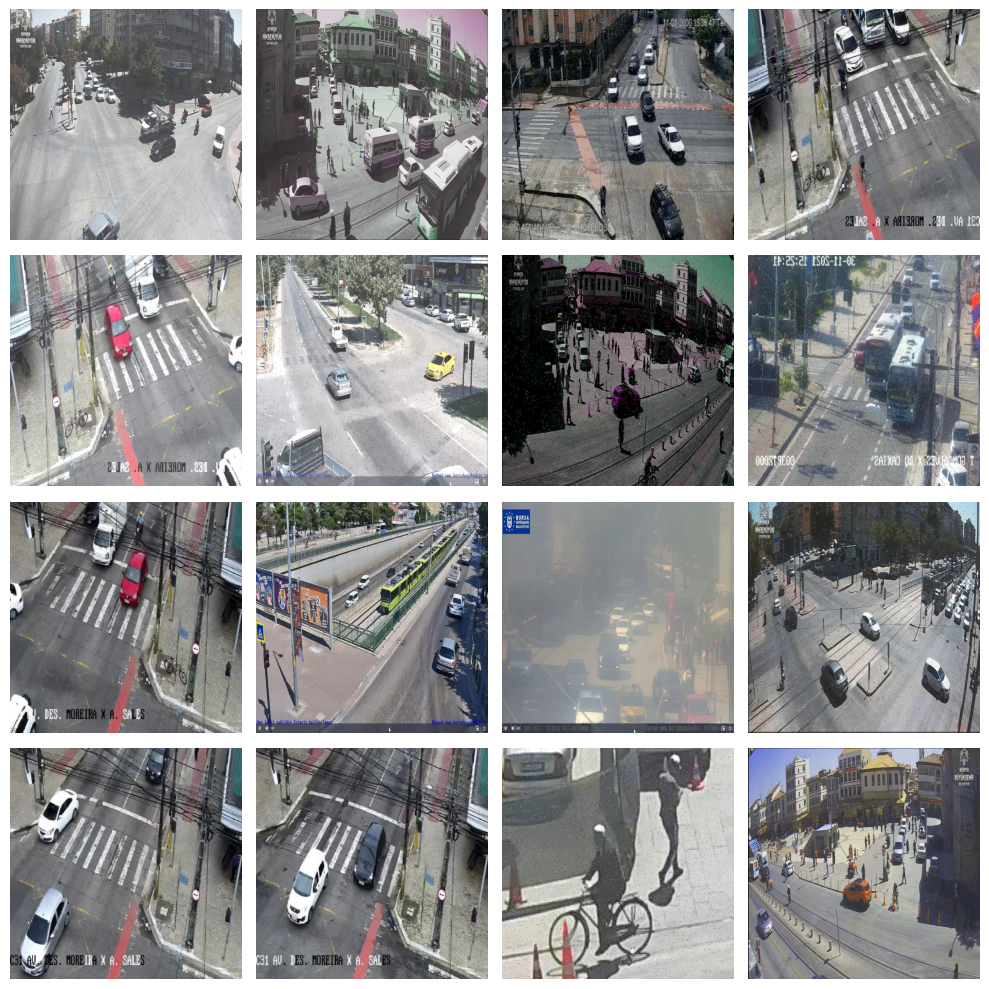
  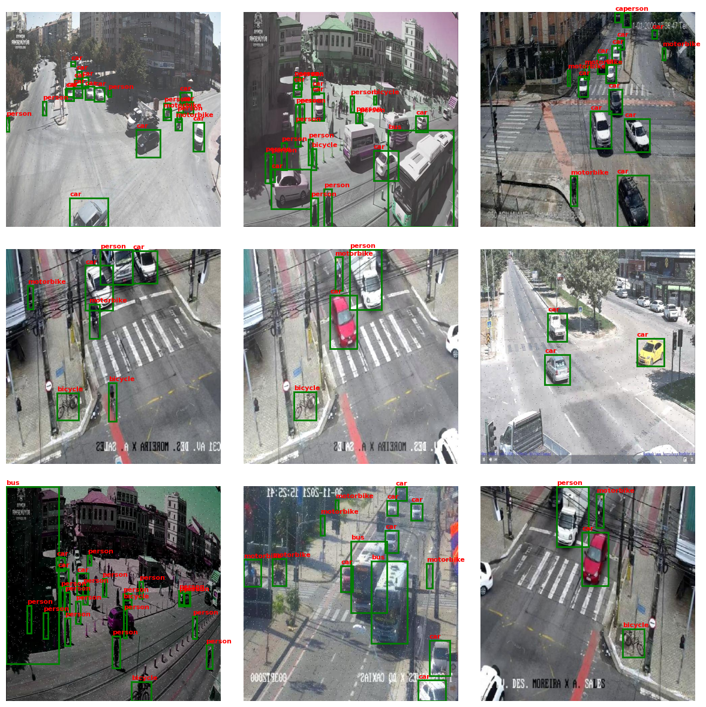

### Labels distribution

  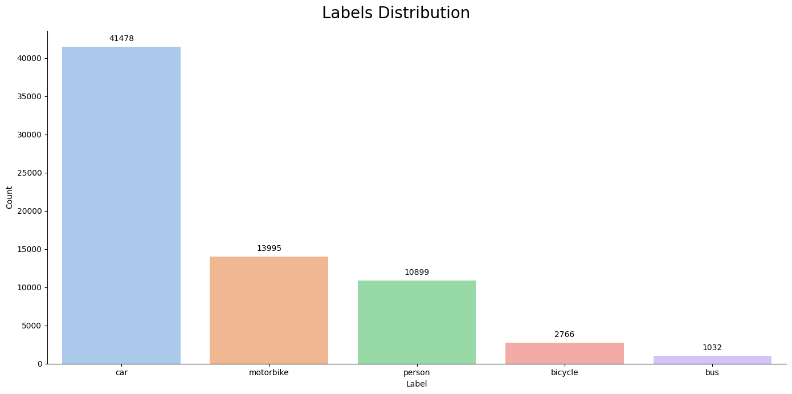

### Spatial Distribution
In the **YOLO** format:  
X=0 is the left edge, X=1 is the right edge.  
Y=0 is the top edge, Y=1 is the bottom edge.

  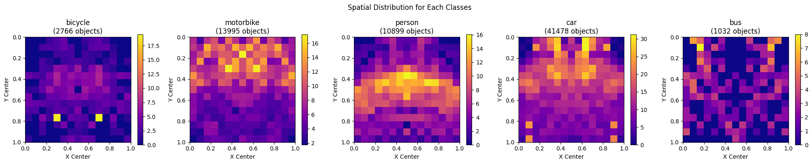

# 🛠️ Methodology 

## ⚙️ **Models**

### YOLO11 (Ultralytics Implementation)
**Version**:
- `YOLO11n` (Nano)

---

### DETR (Facebook Research)
**Architecture**:
- Backbone: ResNet-50
- Learned queries: 100

**Training**:
- AdamW optimizer
- Learning Rate Scheduler: CosineAnnealingLR (T_max=100 | eta_min=0.000001)
- Epochs: 100

### Test Set

  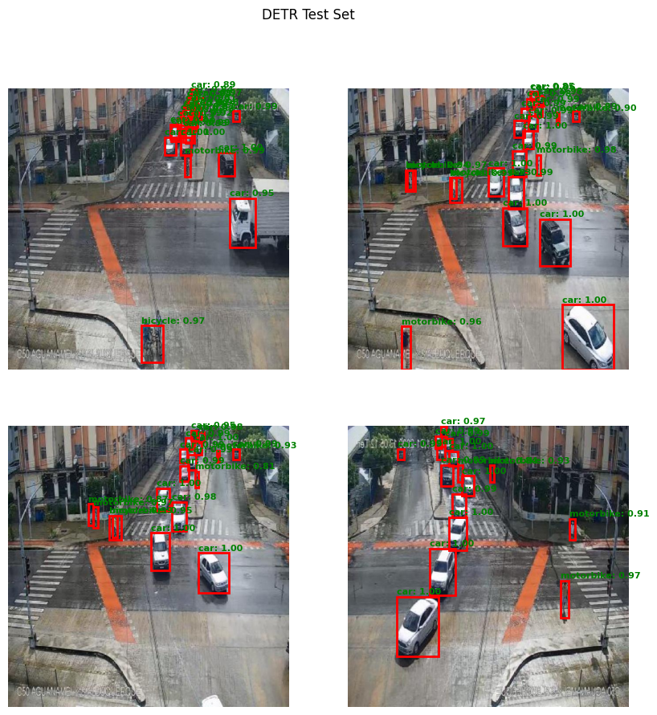
  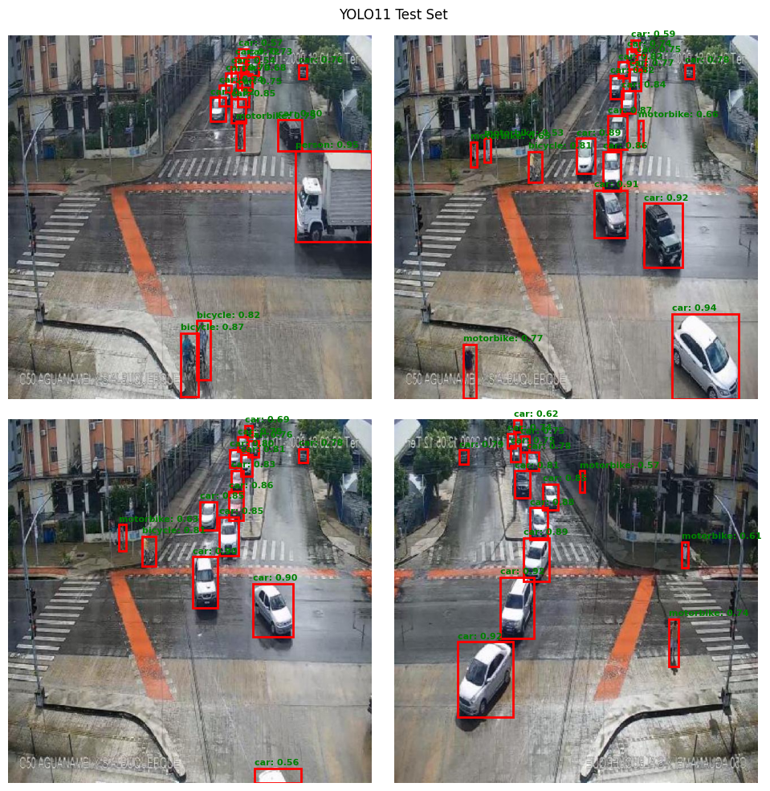

### **Learning Rate Schedulers**
Learning rate schedulers are techniques that dinamically adjust the learning rate during training based on predefined rules or schedules. Common schedulers include:  
**StepLr**: Reduces learning rate at fixed intervals  
**ReduceLROnPlateau**: Reduces learning rate when performance plateaus  
**CosineAnnealingLR** (our focus)

---

### **CosineAnnealingLR**
**CosineAnnealingLR** is a Pytorch scheduler that adjusts the learning rate following a cosine annealing schedule, inspired by the paper [SGDR: Stochastic Gradient Descent with Warm Restarts](https://arxiv.org/abs/1608.03983). This implementation focuses on the cosine decay without warm restarts. 
**How it work**  
The learning rate decays from the initial value ($\eta_{\text{max}}$) to a minimum value ($\eta_{\text{min}}$) over $T_{\text{max}}$ epochs using:

$$ 
\eta_t = \eta_{\text{min}} + \frac{1}{2}(\eta_{\text{max}} - \eta_{\text{min}})(1 + \cos(\frac{t}{T_{\text{max}}}\pi)) 
$$ 

**Parameters**:
- $\eta_t$: Current learning rate at epoch $t$
- $\eta_{\text{max}}$: Initial learning rate (set in optimizer)
- $\eta_{\text{min}}$: Minimum learning rate (default: 0)
- $T_{\text{max}}$: Epochs per decay cycle

---

### **Confusion Matrix in Object Detection** 
The confusion matrix is a tool to evaluate how well a model. Unlike simple image classification, where each image has one label, object detection involves finding and classifying multiple objects, each with its own bounding box. This makes the confusion matrix more complex, as it needs to consider where the objects are (localization) and what they are (classification).  
- **Matching Step:** For each ground truth box, it finds the predicted box with the highest IoU, provided it's above a threshold (often 0.5). This ensures the prediction is close enough to the actual object.  
- **Classification Step:**  
If the predicted box matches a ground truth box and the class is correct, it's a **true positive (TP)** for that class.  
If the predicted box doesn't match any ground truth (or matches but with the wrong class), it's a **false positive (FP)**  
IF a ground truth box has no matching prediction, it's a **false positive (FP)**  

### Dert's metrics  

  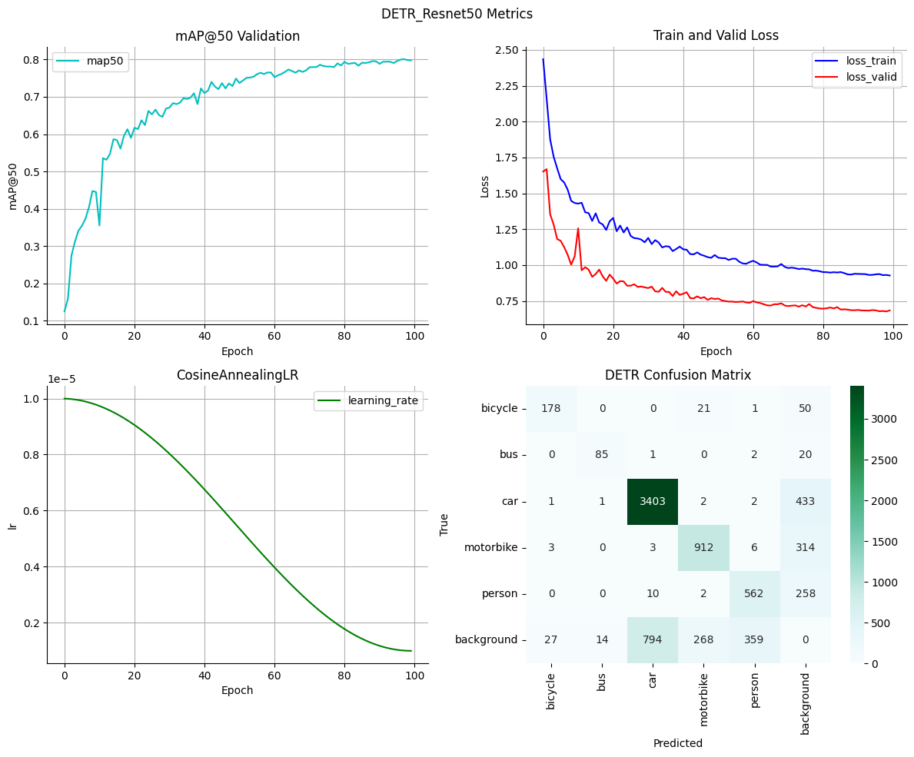

### YOLO11's metrics

  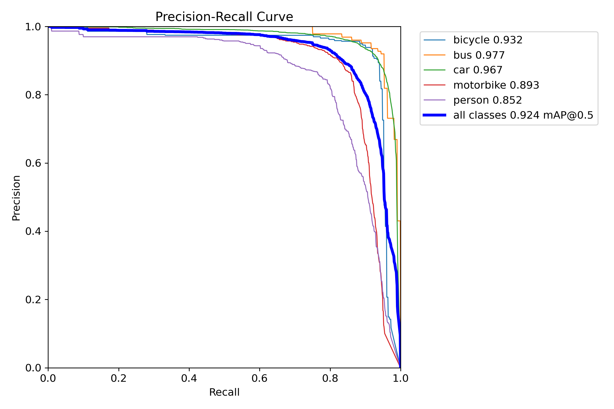
  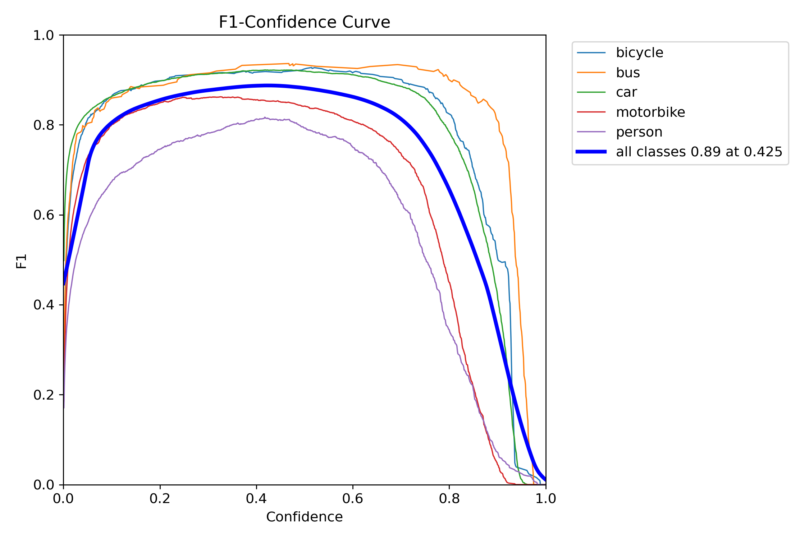
  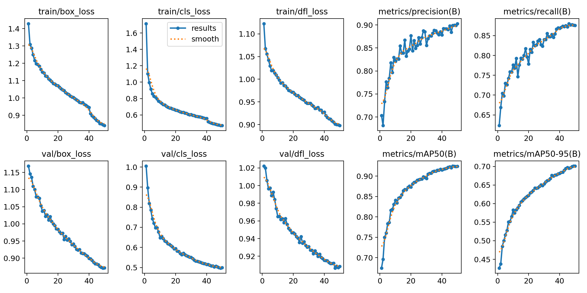
  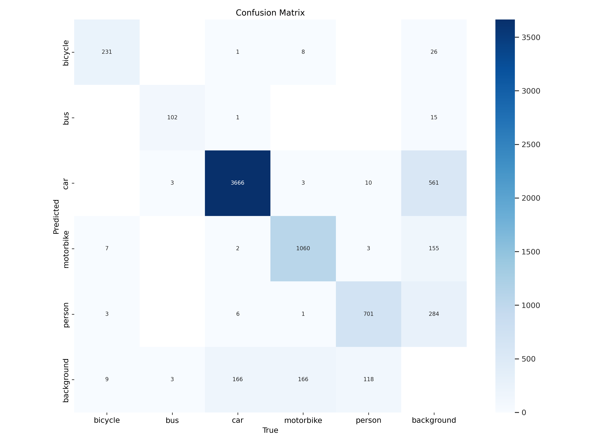
  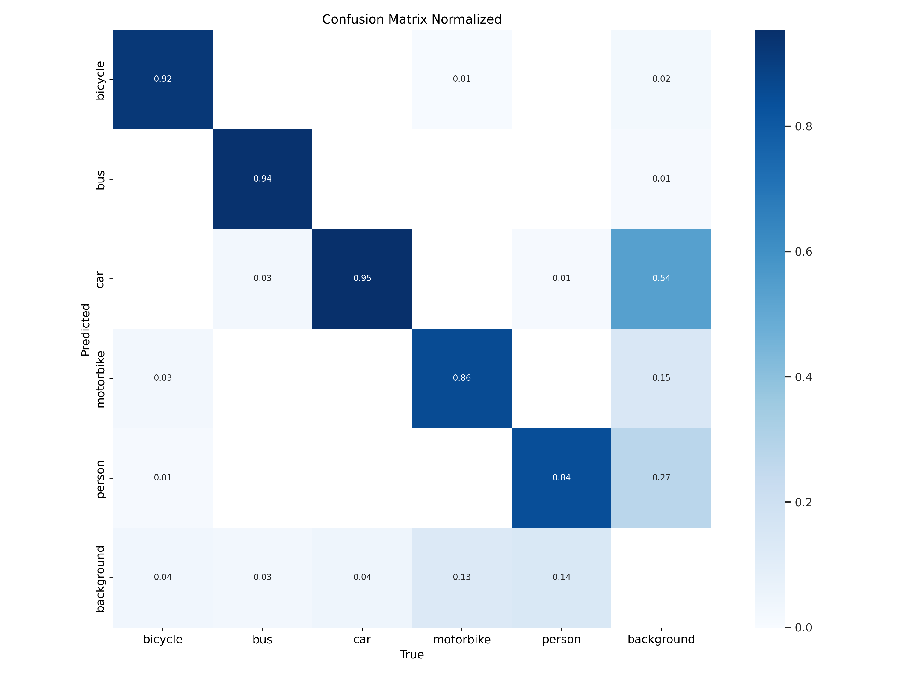

# 🧠 Conclusion

  The experiments reveal a clear performance gap: **YOLOv11n achives approximately 0.95 mAP@50 in just 50 epochs**, significantly outperforming DETR-Resnet50's 0.8 mAP@50 after 100 epochs. This 15% accuracy advantage, combined with YOLOv11n's **2x faster convergence**, demonstrates its superior efficiency for traffic object detection tasks. 

- **YOLO11:** *Introduces a significant change by replacing the **C2f block** in the neck with the **C3k2 block**. The **C3k2 block**
is designed to be faster and more efficient, enhancing the overall performance of the feature aggregation process* [2].  YOLOv11 employs multiple C3k2 blocks within its head structure to efficiently process and further refine the multi-scale feature maps. 

- **DETR:** Relies on transformers, which struggle with small objects due to **fixed-length queries** and **lack of multi-scale priors**. 

# 📚 References  
1. **YOLO11**:
[Ultralytics Documentation](https://docs.ultralytics.com/models/yolo11/)  
2. **YOLOv11: An Overview of the Key Architectural Enhancements**:
[[arXiv](https://www.arxiv.org/abs/2410.17725)]
3. **DETR**: End-to-End Object Detection with Transformers
[[arXiv](https://arxiv.org/abs/2005.12872)]  
4. **Resnet-50**: Deep Residual Learning for Image Recognition
[[arXiv](https://arxiv.org/abs/1512.03385)]  
5. **CosineAnnealingLR**: [[PyTorch Docs](https://docs.pytorch.org/docs/stable/generated/torch.optim.lr_scheduler.CosineAnnealingLR.html#)]  
